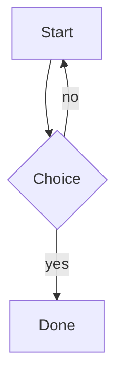

# Features

## Mermaid diagrams

[Mermaid](https://mermaid.js.org/) diagrams are rendered to SVG at build time.
Install the Mermaid CLI once so `mmdc` is on your `PATH`:

```bash
npm install -g @mermaid-js/mermaid-cli
mmdc --version
```

Use a fenced code block:

````markdown

````

Or the block/inline shortcodes:

```jinja

sequenceDiagram
  Alice->>Bob: Hello



```

| Option | Description |
|---|---|
| `theme` | Mermaid theme (`default`, `dark`, `forest`, `neutral`). |
| `backgroundColor` | Background colour. |
| `width`, `height` | Output dimensions. |
| `alt`, `caption` | Alt text and caption for the generated figure. |

Source files live in `diagrams/`; rendered SVGs are written to `images/` and
cached (`.mermaid_cache.json`) so unchanged diagrams are not re-rendered. If
`mmdc` is not installed, Mermaid blocks are skipped with a warning and the rest
of the site still builds.

## Code linking

The code-linking plugin turns identifiers in code blocks and inline code into
documentation links. Configure it in `config/link_schemes.yaml`:

```yaml
link_schemes:
  qt_class:
    enabled: true
    pattern: '\b(?P<name>Q[A-Z]\w+)\b'
    url: 'https://doc.qt.io/qt-6/{name}.html'
    transform:
      name: 'name.lower()'

cppreference:
  enabled: true
```

- `url_type: template` (default) builds URLs from `{group}` placeholders.
- `url_type: cppreference` uses the built-in C/C++ mapper, enabled by the
  `cppreference` block. Indices are downloaded and cached under
  `~/.cache/cppreference/` (override with `cache_dir`).
- `transform` maps are Python expressions evaluated with the named groups as
  locals.
- `priority` controls processing order; `linker_options` sets global options such
  as `link_class` and `skip_existing_links`.

See [Configuration](configuration.md#link_schemesyaml) for the full schema.

## Emoji

Use `:name:` shorthand in Markdown:

```markdown
This is :rocket: and :thumbsup:.
```

Or the shortcode: ``. Unknown names are left unchanged.

## Blog taxonomy pages

Posts with `tags` or `categories` frontmatter generate taxonomy pages
automatically:

```text
build/mysite/tags/index.html
build/mysite/tags/<term>/index.html
build/mysite/categories/index.html
build/mysite/categories/<term>/index.html
```

Configure or disable them under `taxonomies` in `site.yaml` (see
[Configuration](configuration.md#taxonomies)). Inspect terms with:

```bash
pagesmith list-taxonomies --site-dir mysite
```

## Feeds and sitemap

Each build writes:

- `feed.xml` — an RSS/Atom feed built from posts.
- `sitemap.xml` — a sitemap of generated pages.

Set `site.base_url` in `config/site.yaml` so absolute URLs in the feed and
sitemap are correct.
